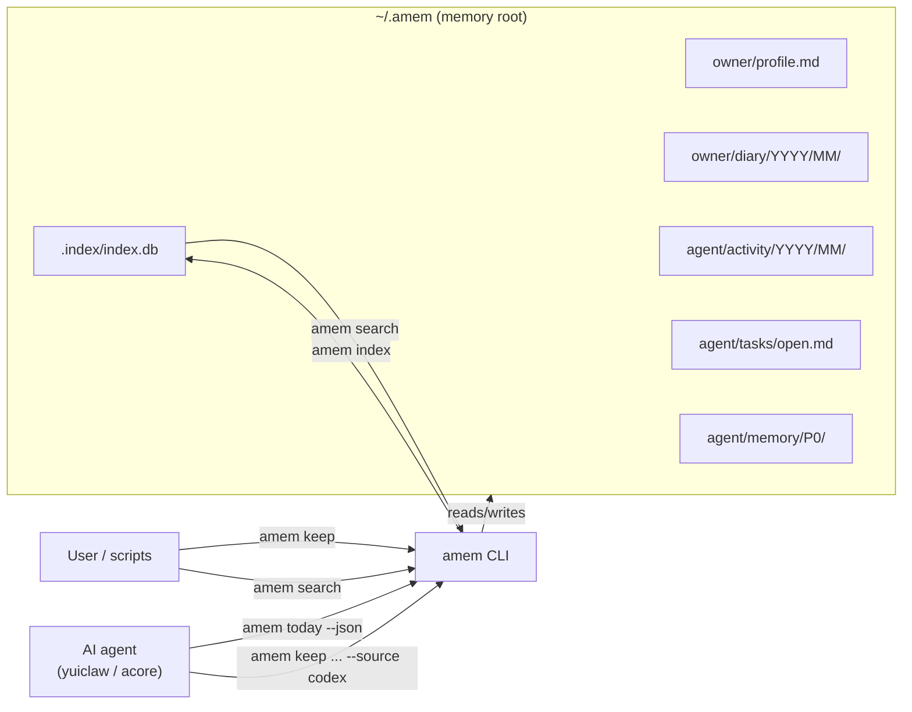

# amem

Local memory CLI for AI assistant or AI agent workflows.

`amem` manages a Markdown-based memory store (default: `~/.amem`) and provides:

- daily snapshot rendering (`today`)
- append-only logging (`keep` / `capture`)
- memory listing and search (`list` / `search`)
- optional SQLite indexing (`index`)
- bridge commands for coding agents (`codex`, `gemini`, `claude`, `copilot`, `opencode`)

## Architecture



`amem today --json` is the primary interface used by `acore` during agent session initialization. It returns a JSON snapshot containing owner profile, agent soul, recent activities, and P0 memories. For daily sections, the snapshot includes a 2-day window (`today` + `yesterday`, newest first), and that same window is injected into the seed prompt for every AI session.

## Install

Build and install from source:

```bash
cd /home/yuiseki/Workspaces/repos/amem
cargo install --path .
```

Run without installing:

```bash
cargo run -q -- --help
```

## Usage

```bash
amem --help
```

Top-level commands:

- `init`
- `search` (alias: `remember`)
- `list` (alias: `ls`)
- `today`
- `keep`
- `which`
- `index`
- `watch`
- `capture`
- `context`
- `get`
- `set`
- `owner` (alias for `get owner`)
- `agent` (alias for `get agent`)
- `codex`
- `gemini`
- `claude`
- `copilot`
- `opencode`

Global options:

- `--memory-dir <path>`: override memory root
- `--json`: JSON output mode

## Quick Start

```bash
amem init
amem keep "Implemented feature X" --kind activity --source manual
amem today
amem search feature --top-k 5
```

## Main Commands

### `amem init`

Create scaffold files/directories (idempotent, non-destructive).

### `amem which`

Print resolved memory root path.

### `amem keep <text>`

Append an entry.

- `--kind <activity|inbox|task-note>` (default: `activity`)
- `--date <yyyy-mm-dd>` (default: today)
- `--source <name>` (default: `manual`)
- Write entries in the owner's language by default (`owner/profile.md` -> `Language`)
- Best-effort Discord mirror: if `DISCORD_BOT_TOKEN` and `DISCORD_NOTIFY_CHANNEL_ID` are exported, or present in `~/.config/yuiclaw/.env`, and `acomm` is on `PATH`, `amem keep` also spawns `acomm --discord --agent <text>` (stdout/stderr suppressed)

Examples:

```bash
amem keep "Investigated bug #123"
amem keep "Read later: article URL" --kind inbox
amem keep "Prepare weekly review" --kind task-note --source codex
```

### `amem capture --kind <kind> --text <text>`

Structured wrapper for `keep` (same write behavior/options).

### `amem list` / `amem ls`

List memory files.

- `--kind <owner|activity|tasks|inbox>`
- `--path <glob>`
- `--date <yyyy-mm-dd>` (string match filter)
- `--limit <n>`

### `amem today`

Render Today Snapshot (Markdown by default, JSON with `--json`).

- `--date <yyyy-mm-dd>`
- Daily sections use a 2-day window: `today` + `yesterday` in descending order
- Markdown snapshot labels use explicit namespaces:
  - `Owner Profile`
  - `Owner Preferences` (hidden when empty)
  - `Owner Diary`
  - `Agent Tasks`
  - `Agent Activities`

### `amem context --task <text>`

Build task-oriented context from today snapshot + related memory hits.

- `--date <yyyy-mm-dd>`

### `amem get ...`

Domain-oriented read commands:

- `amem get owner`
- `amem get owner <name|github|github_username|email|location|job|occupation|lang|native_language|birthday>`
- `amem get owner preference`
- `amem get agent [identity|soul|memory|memories]`
- `amem get diary [today|yesterday|week|month|yyyy-mm-dd]`
- `amem get acts [today|yesterday|week|month|yyyy-mm-dd]`
- `amem get tasks [today|yesterday|week|month|yyyy-mm-dd]`

Top-level aliases:

- `amem owner [<key>|preference]`
- `amem agent [identity|soul|memory|memories]`

`get diary/acts/tasks` options:

- `--limit <n>`
- `--detail` (`get diary`/`get acts`): show full entries
- `--all` (`get diary`/`get acts`): show full entries (ignore default summary mode)
- default behavior:
  - without period: latest 10 entries
  - with period `today|yesterday|yyyy-mm-dd`: all matching entries
  - with period `week` on `diary`/`acts`: daily summary only (max 7 lines)
  - with period `month` on `diary`/`acts`: daily summary only (max 31 lines)
    - use `--detail` or `--all` to show full entries

### `amem set ...`

Domain-oriented write commands:

- `amem set diary <text> [--date yyyy-mm-dd] [--time HH:MM]` (owner diary)
- `amem set owner <key> <value>`
- `amem set owner preference <key:value>` (auto timestamp)
- `amem set acts <text>`
- `amem set tasks <text>` (returns short task id)
- `amem set tasks done <id|text>`

### `amem search <query>` / `amem remember <query>`

Search memory entries (top-k scored hits with snippet).

- `-k, --top-k <n>` (default: `8`)
- `--lexical-only`
- `--semantic-only`

Notes:

- If `.index/index.db` exists, search uses the index; otherwise it scans Markdown files directly.
- `--semantic-only` currently returns no hits (semantic retrieval is not implemented yet).

### `amem index`

Build/rebuild local SQLite index:

- output path: `<memory-root>/.index/index.db`
- `--rebuild`: delete existing DB before rebuilding

### `amem watch`

Reserved command. Current output:

- `watch mode is not implemented yet. use amem index periodically.`

## Coding Agent Bridge Commands

These commands bootstrap memory context into each agent, then resume an interactive session. The injected snapshot uses the same 2-day daily window as `amem today`.

Common options:

- `--resume-only`: skip seed step and directly resume latest session
- `--prompt <text>`: append an initial prompt when resuming

### `amem codex`

- Seed: `codex exec --json --dangerously-bypass-approvals-and-sandbox ...`
- Resume: `codex resume --dangerously-bypass-approvals-and-sandbox ...`
- `--resume-only` uses `codex resume --last`

### `amem gemini`

- Seed: `gemini --approval-mode yolo --output-format json -p ...`
- Resume: `gemini --approval-mode yolo --resume <session_id>`
- `--resume-only` uses `gemini --resume latest`

### `amem claude`

- Seed: `claude --dangerously-skip-permissions --print --output-format json ...`
- Resume: `claude --dangerously-skip-permissions --resume <session_id>`
- `--resume-only` uses `claude --continue`

### `amem copilot`

- Seed: `copilot -p ... --allow-all --share`
- Resume: `copilot --allow-all --resume <session_id>`
- `--resume-only` uses `copilot --allow-all --continue`

### `amem opencode`

- Seed: `opencode run --agent build --format json ...`
- Resume: `opencode --agent build --session <session_id>`
- `--resume-only` uses `opencode --agent build --continue`
- Sets `OPENCODE_PERMISSION={"*":"allow"}` by default
- Sets `OPENCODE_CONFIG_CONTENT={"agent":{"build":{"permission":{"*":"allow"}}}}` by default
- Set `AMEM_OPENCODE_AGENT` to override the default `build` agent
- Set `AMEM_OPENCODE_PERMISSION` (or pre-set `OPENCODE_PERMISSION`) to override permission policy
- Set `AMEM_OPENCODE_CONFIG_CONTENT` (or pre-set `OPENCODE_CONFIG_CONTENT`) to override config-content policy

Note:

- Bridge commands default to YOLO/auto-approval style flags to reduce repeated permission prompts.

## Memory Layout

Default root: `~/.amem`

Scaffold created by `amem init`:

- `owner/profile.md`
- `owner/personality.md`
- `owner/preferences.md`
- `owner/interests.md`
- `owner/diary/YYYY/MM/YYYY-MM-DD.md` (created on first diary write)
  - YAML frontmatter:
    - `summary`: one-line daily summary (empty is allowed for today)
- `agent/tasks/open.md`
- `agent/tasks/done.md`
- `agent/inbox/captured.md`
- `agent/activity/YYYY/MM/YYYY-MM-DD.md` (created on first write)
  - YAML frontmatter:
    - `summary`: one-line daily summary (empty is allowed for today)

Compatibility:

- Legacy paths (`tasks/*`, `inbox/*`, `activity/*`) are still read for backward compatibility.

Default `owner/profile.md` template fields:

The generated scaffold documents that `amem` entries should be recorded in the owner's language by default, using `owner/profile.md` -> `Language` as the source of truth.

- `name`
- `github_username`
- `location`
- `occupation`
- `native_language`

Index files:

- `.index/index.db`

## Environment Variables

- `AMEM_DIR`: override memory root (same priority as `--memory-dir`, lower than CLI flag)
- `AMEM_CODEX_BIN`: override `codex` executable
- `AMEM_GEMINI_BIN`: override `gemini` executable
- `AMEM_CLAUDE_BIN`: override `claude` executable
- `AMEM_COPILOT_BIN`: override `copilot` executable
- `AMEM_OPENCODE_BIN`: override `opencode` executable
- `AMEM_OPENCODE_AGENT`: override OpenCode agent name (default: `build`)
- `AMEM_OPENCODE_PERMISSION`: override OpenCode permission JSON passed as `OPENCODE_PERMISSION`
- `AMEM_OPENCODE_CONFIG_CONTENT`: override OpenCode config JSON passed as `OPENCODE_CONFIG_CONTENT`

## Development

```bash
cargo fmt
cargo test
cargo build
```
